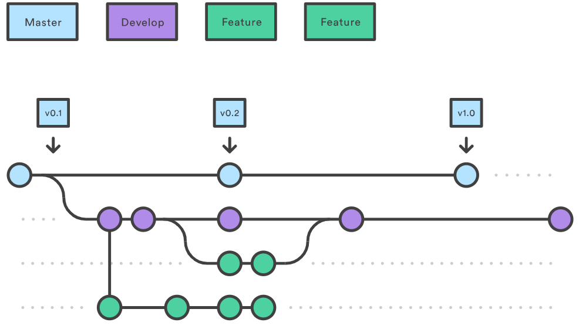

# Training GIT

---

## Sobre GIT

---

---

## GUIA RAPIDA

- git clone <remote_url>
- git checkout -b feature/AUNA-NNN
- git status
- git add . (git add -i)
- git commit -m "El mensaje del commit"
- git push origin feature/AUNA-NNN

---

## Nombrar branches

- feature/AUNA-XXX-titulo-de-la-historia (Para Historias)
- hotfix/AUNA-XXX-descripcion-del-bug (Para Bugs)

---

## Otros casos

- docs/AUNA-XXX-descripcion-de-la-documentacion
- style/AUNA-XXX-descripcion-del-formateo
- refactor/AUNA-XXX-descripcion-del-refactor-del-codigo
- test/AUNA-XXX-descripcion-de-las-pruebas-unitarias
- chore/AUNA-XXX-descripcion-del-cambio-del-build

---

## Enviar codigo

- git pull --rebase origin dev
- git push -f origin feature/AUNA-NNN

---

## Revisar el LOG

- git log --oneline --decorate --graph --all (previsualización de los commits que se van a enviar a origin/dev)

---

## Buenas Practicas

- Commits simples

> Trata de realizar commits cuando tengas un avance que se pueda guardar en un commit, asi mantenemos el log limpio y entendible

---

- Hace mas facil para otras personas del equipo que vean tus cambios y lo revisen haciendo mas eficiente el trabajo de comprenderlo.
- Si el commit tiene que ser deshecho, es muy facil de entender la razon
- Es muy facil de mantener un seguimiento de los cambios en el sistema de tickets

---

- Mensajes de los commits con significado
- Comitea temprano, comité frecuentemente
- No committees los archivos generados
- Prueba el codigo antes de comitear

---

## Crear un branch

- git checkout -b feature/AUNA-001-my-awesome-feature dev
- git checkout -b hotfix/AUNA-001-important-hotfix master

---

> y al enviar el cambio

git push -u origin HEAD

## Comandos indispensables

- git add -p
- git stash / git stash pop
- git fetch --all --prune
- git reset --soft HEAD~1

---

## Git Stash

Mantengamos nuestro trabajo mientras revisamos lo anterior

- git stash
- git fetch --all --prune
- git pull --rebase origin {dev|uat|master}
- git stash pop

---

## Comandos indispensables 2

- git reset
- git diff --staged
- git rebase -i HEAD~2
- git checkout – .
- git reset --hard origin/{BRANCH}
